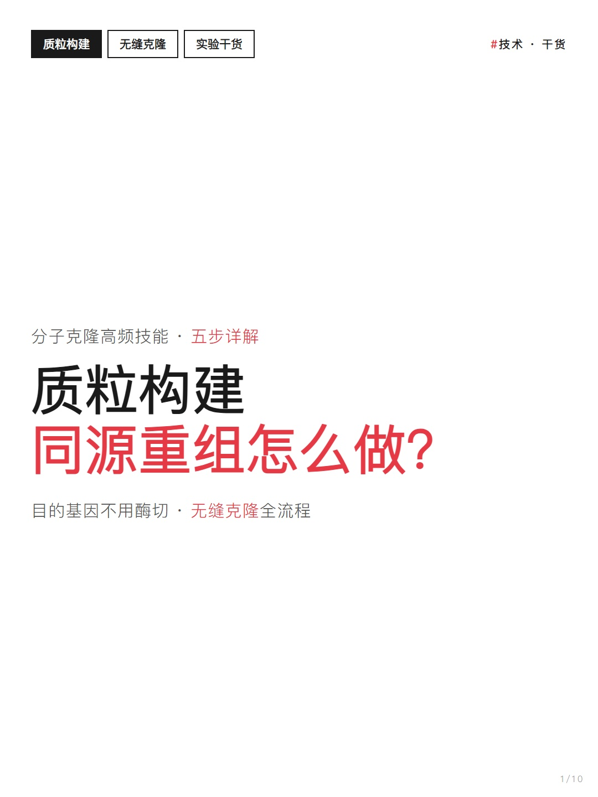
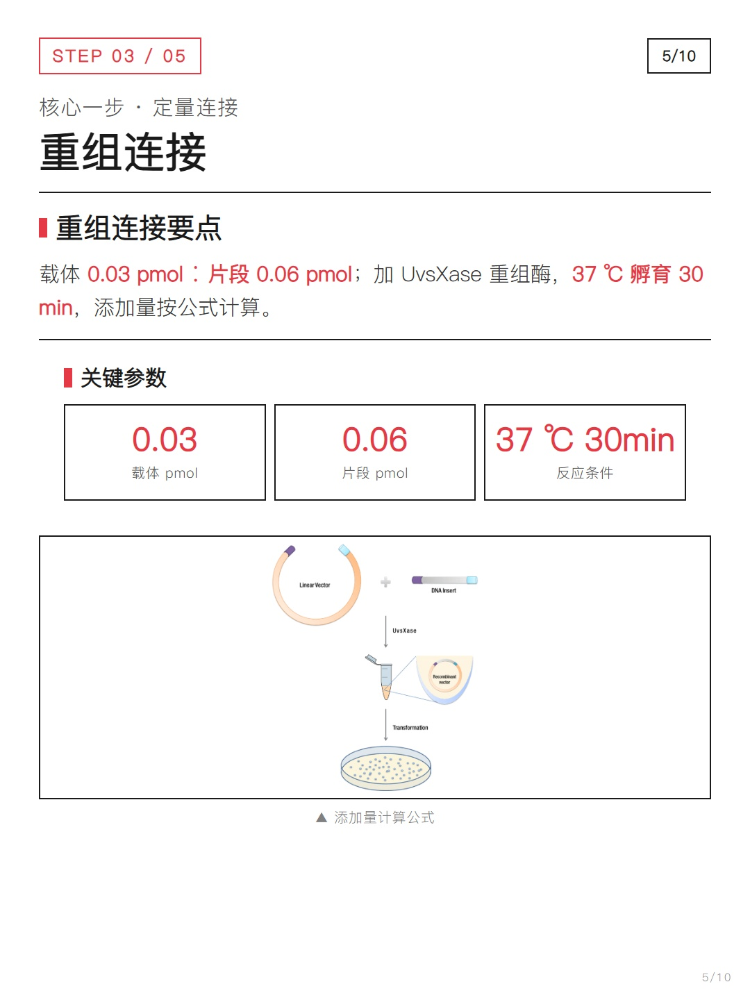
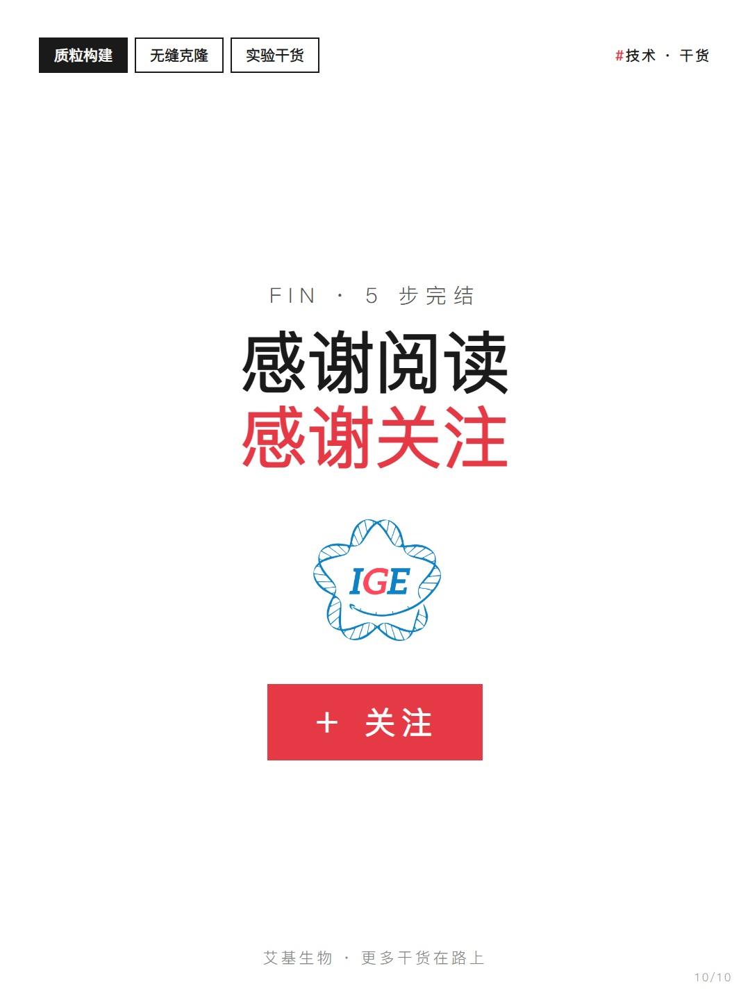
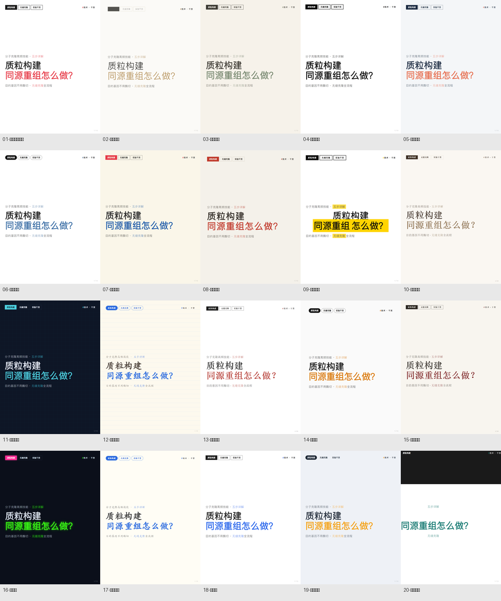

# xiaohongshu-card

把公众号/搜狐科普文章一键做成小红书卡片组 — 1080×1440 · 原文配图解密 · Playwright 校验 · JPG 导出

Xiaohongshu (RED) card generator as an AI Agent Skill — turn WeChat Official Account / Sohu science articles into a set of 1080×1440 vertical cards with original figures, programmatic QA and high-quality JPG export.

> 本仓库是一个 **AI Agent Skill**（技能包），供 WorkBuddy / Claude Code 等支持 skills 的 agent 加载使用。

[](LICENSE)
[](SKILL.md)
[](scripts/verify.js)
[](README.md)

---

## 简介

做小红书科普图文，通常要经过：抓取公众号 / 搜狐文章 → 提炼核心要点 → 下载原文配图（常被平台加密）→ 设计卡片排版 → 反复校对溢出与留白 → 导出多图。繁琐且标准难统一。

`xiaohongshu-card` 把这一整条链路固化为可复用的技能：**输入一篇科普文章，输出一整套 10 页左右、可直接发布的小红书卡片（JPG 多图）**，全程无需手动排版。

适用场景：分子生物学 · 合成生物学 · 科研科普 · 生物公司内容运营 · 公众号内容小红书化。

---

## 效果预览

以下截图来自实际生产案例——质粒构建系列《同源重组怎么做？》，已按 1080×1440 导出为 10 页。

| 区域 | 内容 |
|------|------|
| 封面 | 纯文字居中构图 + 品牌标签 |
| 步骤页 | STEP 编号 + 大标题 + 原文配图 + 关键参数卡 |
| 封底 | 品牌 LOGO + 关注引导 |

### 封面



### 步骤页（原文配图）



### 封底（关注引导）



---

## 功能特性

### 卡片规格

| 参数 | 值 |
|------|------|
| 尺寸 | 1080×1440px（3:4，小红书推荐比例） |
| 格式 | JPEG |
| 质量 | 95% |
| 交付 | 仅 JPG（语义命名：`01-封面.jpg` … `10-封底.jpg`） |
| 移动端字号 | 正文 29-30px / 大标题 60-92px / 参数 46px |

### 配图策略：原文图优先

| 优先级 | 来源 | 说明 |
|--------|------|------|
| 1 | 原文配图 | 抓取原文图片，并核对与正文一一对应 |
| 2 | 搜狐 AES 解密 | 搜狐图片 `data-src` 为 AES-ECB-PKCS7 加密，内置解密脚本还原真实 CDN URL |
| 3 | AI 生成（需标注） | 仅当原文确实无图时，白底单色示意图，且向用户标注「AI 生成」 |

**不接受**：图文无关的通用图库配图。

### 页面结构（固定模板 · 步骤数自适应）

```
封面 → 概览 → STEP 步骤页（每步一页，STEP 0N/总步数）→ 避坑 → FAQ → 封底
```

- 步骤数随内容自适应（不限于 5 步）
- 内容 / 配图拥挤时自动拆页（每页 1-2 个信息块）

### 20 种设计风格（CSS 变量主题系统 + 布局级差异）

同一内容一键切换 20 种视觉风格（前 10 种配色主题、后 10 种**布局级差异**：时间轴、分屏、卡片堆叠、手账横线等）；模板支持 `?style=xxx` 参数切换、`?all-styles` 全风格对比。**skill 每次启动随机选择风格，且避免与上一次重复**（记录在 `.last-style`，首次使用纯随机）。

| # | 风格 | 视觉签名 |
|---|---|---|
| 1 | 理性实验手册 | 白底黑字 + 红色 #E63946、瑞士网格、斜体大编号 |
| 2 | 高级留白 | 米白 + 暖金 #D4A574、金线 |
| 3 | 柔和科普 | 米色 + 自然绿 #7a8a72、圆角柔影 |
| 4 | 瑞士海报 | 纯黑白 900 粗体、严格网格 |
| 5 | 科研数据 | 浅蓝灰底 + 橙 #E76F51、等宽数字 |
| 6 | 内容优先 | 纯白 + 单蓝 #3B6EA5、药丸标签 |
| 7 | 活力撞色 | 米黄底 + 红蓝撞色、圆润 |
| 8 | 日式空寂 | 纸色 + 朱红印章、大留白 |
| 9 | 海报宣言 | 纯黑大粗字居中、黄仅作高亮底 |
| 10 | 书籍版式 | 衬线、装订线左栏、深棕墨 |
| 11 | 数据大屏 | 暗色底 + 网格线 + 参数模块发光 |
| 12 | 手账便签 | 横线纸底 + 楷体 + 胶带便签块 |
| 13 | 杂志版式 | 衬线 + 首字下沉 + 双线分隔 |
| 14 | 单焦点 | 超大字 + 每页单焦点 + 极致留白 |
| 15 | 报纸版式 | 旧纸色 + 双线栏 + 衬线头条 |
| 16 | 霓虹灯 | 暗底 + 绿粉霓虹发光字 |
| 17 | 手绘草稿 | 手绘虚线边框 + 楷体涂鸦感 |
| 18 | 时间线 | 左侧圆点时间轴贯穿 |
| 19 | 卡片堆叠 | 独立白卡片 + 角标 + 贴纸墙 |
| 20 | 分屏对比 | 上深下浅分屏 + 标题区深色 |



### 质量校验（强制）

Playwright 程序化校验（`scripts/verify.js`），不达标自动迭代调整：

- 内容页填充率 **80-100%**（空位 ≤ 20%）
- **无溢出**（内容最深元素 ≤ 卡高）
- **图片全部加载成功**

### 红线

- ❌ 内容来源 / 点赞收藏 CTA（平台受限信息）
- ❌ 编造内容（所有信息必须来自原文）
- ❌ emoji 装饰 / 紫色渐变 / SVG 假图
- ❌ 配图与正文不对应（需核对原文位置）

---

## 使用方法

### 安装

将本目录放置到 agent 的 skills 目录（例如 WorkBuddy 的 `~/.workbuddy/skills/xiaohongshu-card/`）。

### 环境依赖

```bash
npm i playwright
npx playwright install chromium      # 截图导出必需
pip install pycryptodome             # 仅搜狐图片解密用
```

### 触发

直接提供文章链接并说明意图：

```
把这篇做成小红书卡片
https://www.sohu.com/a/xxxxxxx_xxxxxxx
```

### 品牌配置

复制 `assets/brand-config.example.json` 为 `brand-config.json` 修改品牌名、LOGO 路径与封底文案。默认内置艾基生物配置（将品牌 LOGO 放置到 `assets/logo-ige.png` 即可）。

---

## 目录结构

```
xiaohongshu-card/
├── SKILL.md                          # 主流程 + 标准 + 触发词
├── README.md                         # 本说明
├── LICENSE                           # MIT 许可证
├── assets/
│   ├── card-template.html            # 10 页卡片模板（数据驱动，单文件）
│   └── brand-config.example.json     # 品牌配置示例（LOGO / 封底文案）
├── scripts/
│   ├── decrypt-sohu.py               # 搜狐图片 AES 解密脚本
│   ├── verify.js                     # Playwright 质量校验脚本
│   └── export-jpg.js                 # JPG 导出脚本
└── screenshots/                      # 实际案例截图（README 预览用）
```

---

## 版本记录

| 版本 | 说明 |
|------|------|
| v1.0.0 | 首次发布：沉淀自艾基生物质粒构建系列实战，通用工作流 + 品牌配置 |

---

## 许可

MIT License

Copyright (c) 2026 flyanx

本技能基于实际小红书发布工作流沉淀，可自由 fork / 修改 / 复用。

---

## 关键词 / Keywords

小红书卡片 · 小红书图文 · 科普卡片 · 公众号转小红书 · 搜狐文章转卡片 · 知识卡片 · 卡片设计 · 小红书运营 · 分子生物学科普 · Xiaohongshu card · RED note cards · WeChat to Xiaohongshu · social media card generator · Playwright card export · agent skill
